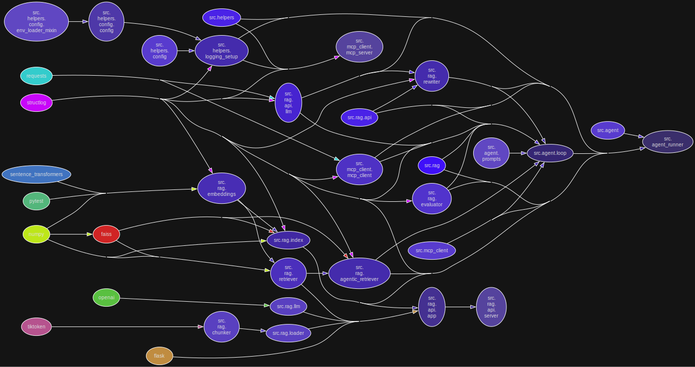
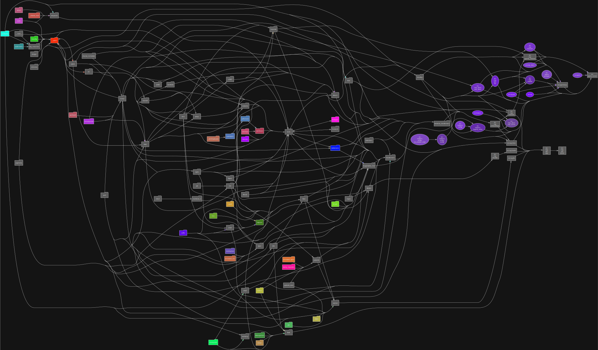

# Python AI Agent Excercise

## Requirements

- [UV](https://github.com/astral-sh/uv) package manager

### Project structure diagrams

##### Modular perspective

<p align="center">
  
</p>

##### Library dependencies perspective

<p align="center">
  
</p>

## Local development (Windows PowerShell):

You can also use VSCode `settings.json` and `launch.json` files to run the project (choose interpreter created by UV).

## Fast native Windows development

```commandline

##### LOCAL RUN:

Start-Process uv -ArgumentList "run", "python", "src\main.py" ; 
Start-Sleep -Seconds 20 ; 

##### INVOKE API REQUESTS:

Invoke-RestMethod -Uri http://127.0.0.1:5000/index -Method POST ; 

##########

# Prepare JSON body
$body = @{ query = "What is KSeF?" } | ConvertTo-Json

# Call the Flask query endpoint
$response = Invoke-RestMethod -Uri http://127.0.0.1:5000/query `
    -Method POST `
    -Body $body `
    -ContentType "application/json"

$response

##########

$body = @{ query = "What is Camunda?" } | ConvertTo-Json

# Call the Flask query endpoint
$response = Invoke-RestMethod -Uri http://127.0.0.1:5000/ask `
    -Method POST `
    -Body $body `
    -ContentType "application/json"

$response

#####

$body = @{ query = "What is Devapo?" } | ConvertTo-Json

# Call the Flask query endpoint
$response = Invoke-RestMethod -Uri http://127.0.0.1:5000/ask `
    -Method POST `
    -Body $body `
    -ContentType "application/json"

$response

#####

$body = @{ query = "What is Ksef?" } | ConvertTo-Json

# Call the Flask query endpoint
$response = Invoke-RestMethod -Uri http://127.0.0.1:5000/ask `
    -Method POST `
    -Body $body `
    -ContentType "application/json"

$response
```

## Full static analysis

Login in SonarQube as `admin` with password `Admin1@Admin1@`.

```commandline
deactivate ; 
clear ; 

docker system df ; 
docker compose down -v --remove-orphans ; 
docker stop $(docker ps -a -q) ; 
docker rm -f $(docker ps -a -q) ; 
docker system prune --volumes -a -f ; 
docker volume rm -f $(docker volume ls -q) ; 
docker system df ; 

$ports = 5433

foreach ($port in $ports) {
    $conns = Get-NetTCPConnection -LocalPort $port -ErrorAction SilentlyContinue
    if ($conns) {
        $conns | Select-Object -ExpandProperty OwningProcess -Unique |
            Where-Object { $_ -gt 0 } |
            ForEach-Object {
                Write-Host "Port $port is used by PID $_. Killing..."
                Stop-Process -Id $_ -Force -ErrorAction SilentlyContinue
            }
    } else {
        Write-Host "No process is using port $port."
    }
}

uv self update ; 
uv cache clean ; 

git reset --hard HEAD ; 
git clean -x -d -f ; 

#####

uv python install 3.14 ; 
uv python pin 3.14 ; 
uv sync --dev --no-cache ; 
uv lock ; 

##### STATIC ANALYSIS & TESTS

.venv\Scripts\Activate.ps1 ; 
$env:UV_ENV_FILE = ".dev.env" ; 

.\scripts\format_and_lint.ps1 ; 

uv run pytest tests/ --cov=src --cov-report=html --cov-report=xml --cov-config=.coveragerc -vv -m "not slow" ; 

Start-Process .\htmlcov\index.html ; 

```

Check installed models:

```commandline
ollama list ; 
```